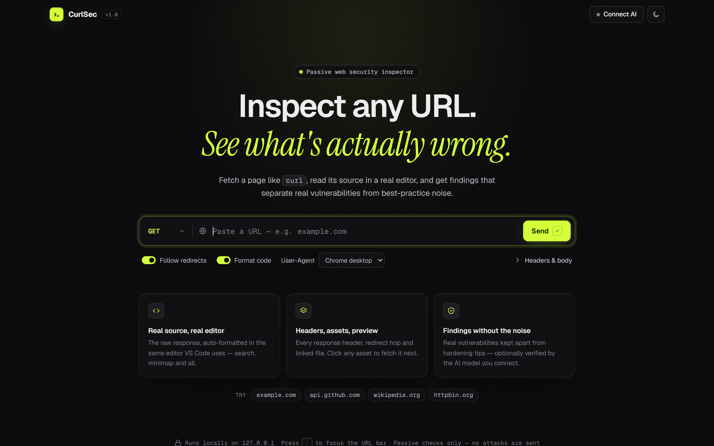
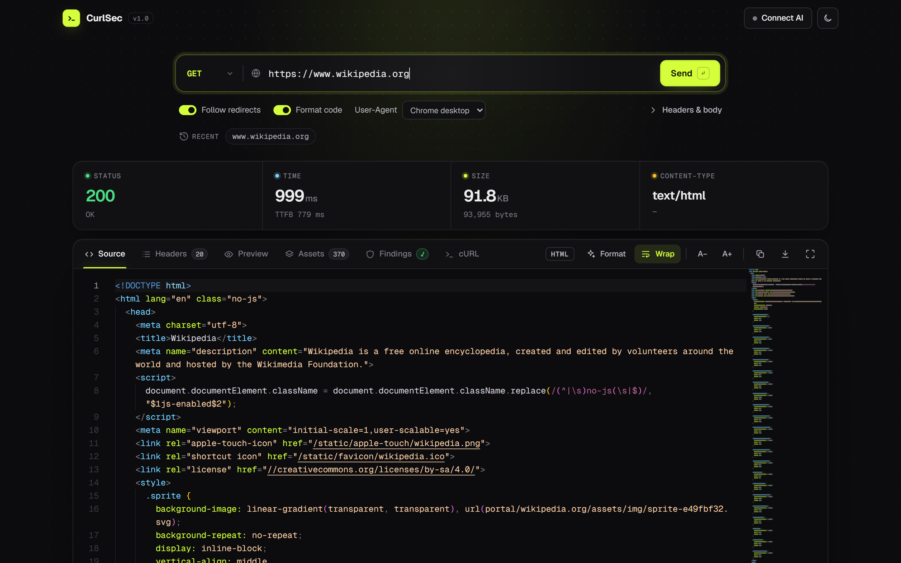
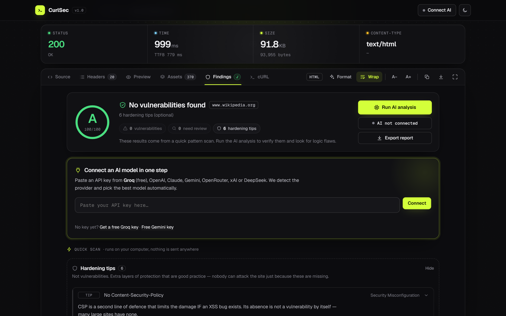
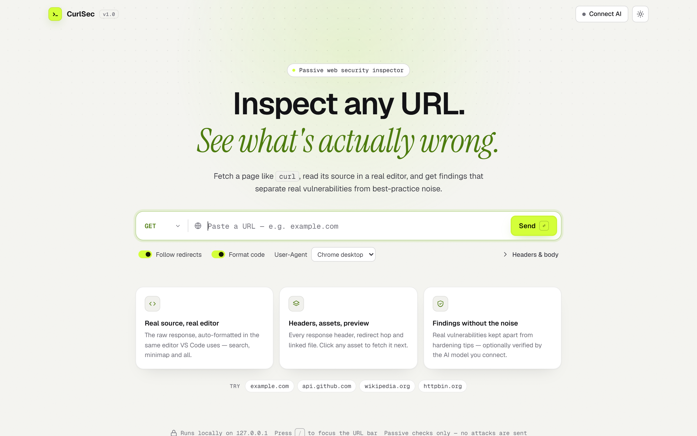

<div align="center">

# CurlSec

**Inspect any URL. See what's actually wrong.**

A local, passive web inspector: fetch a page like `curl`, read its source in a real code editor, and get security findings that keep **real vulnerabilities** apart from **best-practice noise**. You can optionally have an AI model verify the findings.


<br />

<picture>
  <source media="(prefers-color-scheme: light)" srcset="screenshots/home-light.png" />
  
</picture>

</div>

---

## ✨ Features

| | |
|---|---|
| **Real source, real editor** | The raw response is auto-formatted (HTML, CSS, JS, JSON) and opened in Monaco, the editor VS Code uses, with search, minimap and sticky scroll. |
| **Headers, assets, preview** | Every response header, the full redirect chain, cookies, and a live preview. Every linked CSS, JS, image and link is listed, and one click fetches it next. |
| **Findings without the noise** | A built-in passive scanner sorts results into **Vulnerabilities**, **Needs review** and **Hardening tips**. Only real issues lower the grade. |
| **AI deep analysis (optional)** | Paste one API key and CurlSec detects the provider, checks the key and picks a model. The AI reviews the code for logic flaws, exposed secrets and XSS paths. |
| **Copy as cURL** | Every request is shown as a ready-to-run `curl` command. |
| **Polished UI** | Light and dark themes, an intro video, keyboard shortcuts, and a layout that works on phone screens. |

## 📸 Screenshots

<table>
  <tr>
    <td width="50%"></td>
    <td width="50%"></td>
  </tr>
  <tr>
    <td align="center"><b>Source</b> · stats, tabs and the formatted response in Monaco</td>
    <td align="center"><b>Findings</b> · grade, grouped results and one-step AI connect</td>
  </tr>
  <tr>
    <td width="50%"></td>
    <td width="50%"></td>
  </tr>
  <tr>
    <td align="center"><b>Dark theme</b></td>
    <td align="center"><b>Light theme</b></td>
  </tr>
</table>

## 🚀 Quick start

### Windows (easiest)

1. Download or clone this repository (if you downloaded a `.zip`, **Extract All** first).
2. Double-click **`start.bat`**.
3. Your browser opens CurlSec automatically. Keep the black window open while you use it.

`start.bat` checks that Node.js is installed and recent enough. If it's missing, it offers to install it for you.

### Any OS

```bash
git clone https://github.com/<your-username>/curlsec.git
cd curlsec
node server.js --open
```

Then open **http://localhost:3000** (the `--open` flag does this for you).

> **Requirements:** [Node.js 18+](https://nodejs.org) and an internet connection (the editor and fonts load from a CDN). There is no `npm install`: CurlSec has **zero dependencies**.

## 🧭 How to use

1. Type or paste a URL, then press **Enter** (or **`/`** to jump to the URL bar from anywhere).
2. Look through the tabs: **Source**, **Headers**, **Preview**, **Assets**, **Findings**, **cURL**.
3. Open **Findings** to see the security report.
4. *(Optional)* Click **Connect AI**, paste an API key, then press **Run AI analysis**.

Choose the HTTP method, User-Agent (Chrome, iPhone, Android, Googlebot, curl), custom headers and request body from the options under the URL bar.

## 🛡 Findings explained

Most scanners flag every missing header as a "vulnerability". CurlSec doesn't:

| Group | Meaning | Examples |
|---|---|---|
| 🚨 **Vulnerabilities** | Real, evidence-backed problems | Leaked API keys or private keys, forms that send passwords over HTTP, stack traces in responses, credentialed wildcard CORS |
| 🔎 **Needs review** | Could be a problem; a human has to confirm | URL data flowing near HTML sinks, client-side role checks, outdated libraries with known CVEs, session cookies without `HttpOnly` |
| 🛡 **Hardening tips** | Good practice, **not** vulnerabilities | Missing CSP / X-Frame-Options / Referrer-Policy, SRI, version banners |

The **A–F grade** counts only vulnerabilities and items that need review. Hardening tips never lower it.

## 🤖 AI providers

Paste a key and CurlSec handles the rest:

| Provider | Key looks like | Free tier |
|---|---|---|
| [Groq](https://console.groq.com/keys) | `gsk_…` | ✅ |
| [Google Gemini](https://aistudio.google.com/apikey) | `AIza…` | ✅ |
| Anthropic (Claude) | `sk-ant-…` | |
| OpenAI | `sk-…` | |
| OpenRouter | `sk-or-…` | |
| xAI (Grok) | `xai-…` | |
| DeepSeek | `sk-…` | |
| Ollama / any OpenAI-compatible API | — | ✅ local |

Under **Advanced settings** you can change the model and base URL, choose how many linked JS files are sent, and set a code size limit. If a model rejects a request as too large (common on free tiers), CurlSec automatically retries with less code.

## 🔒 Privacy & safety

- The server listens on **127.0.0.1 only**, so other devices on your network can't use it.
- Your API key goes only to your local server and from there straight to the provider you chose. It's saved in your browser only if you keep "Remember API key" on.
- Page code goes to an AI provider **only** when you click *Run AI analysis*.
- The built-in scanner is **passive**: it reads the response and never sends attack payloads.

> ⚠️ **Use responsibly.** Only analyse sites you own or have permission to test. Automated findings are hints, not proof. Confirm them before reporting.

## 📁 Project structure

```
curlsec/
├── start.bat          # One-click launcher for Windows (checks Node.js, opens the browser)
├── server.js          # Zero-dependency Node server: fetch proxy, AI proxy, static files
├── assets/
│   └── IMG_4142.MP4   # Intro video shown on the loading screen
├── screenshots/       # Images used in this README
└── public/
    ├── index.html     # App shell, design tokens, editor and request logic
    ├── ui.js          # Icon set, theme switching, animations
    ├── security.js    # Findings engine, AI connect and analysis
    └── security.css   # Findings, connect card and modal styles
```

## ⚙️ Configuration

| Setting | How |
|---|---|
| Port | `PORT=4000 node server.js` (default `3000`; if it's busy, the next free port is used) |
| Open browser on start | `node server.js --open` |
| Intro video | Replace the file in `assets/` and update the `src` in `public/index.html` |

## 🩺 Troubleshooting

| Problem | Fix |
|---|---|
| `'node' is not recognized` | Install Node.js 18+ from [nodejs.org](https://nodejs.org) or let `start.bat` install it, then run it again. |
| "Windows protected your PC" | Click **More info → Run anyway**. |
| The page says *"Open CurlSec with start.bat"* | You opened `index.html` directly. Run `start.bat` (or `node server.js`) instead. |
| The editor doesn't load | Check your internet connection (the editor loads from a CDN). |
| AI says the key was rejected | Copy the full key again, or create a new one on the provider's dashboard. |

## 🧰 Built with

[Node.js](https://nodejs.org) · [Monaco Editor](https://microsoft.github.io/monaco-editor/) · [js-beautify](https://github.com/beautifier/js-beautify) · [Geist](https://vercel.com/font) & [Instrument Serif](https://fonts.google.com/specimen/Instrument+Serif) fonts

---

<div align="center">
<sub>Made with care. If CurlSec helped you, consider giving it a ⭐</sub>
</div>
